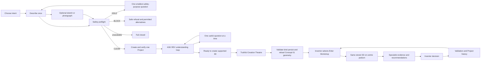

# reAIdea Founder Product Constitution

**Status:** FOUNDER APPROVED — highest current product authority
**Date:** Approved 26 August 2026
**Purpose:** Define the durable product truths that every reAIdea build must preserve

## Authority

This Constitution consolidates the founding intent, dated founder approvals and the completed architecture audit. The founder accepted it on 26 August 2026 as the highest current product document. Scoped visual approvals and accepted construction checkpoints remain binding evidence beneath it.

Historical founder journals, blueprints, handovers and construction records remain immutable evidence of reAIdea's evolution. They are not deleted or rewritten. Where they conflict with this Constitution, the supersession is recorded in `architecture/SUPERSESSION_REGISTER.md`.

Security controls in `SECURITY_ENGINEERING_STANDARD.md` remain mandatory. A later product instruction cannot silently weaken a safety or security control.

## Product promise

reAIdea is an outcome-delivery service for inventors: effortless for the inventor and rigorous behind the scenes.

> Choose your intent, describe the invention once, and ASK REV. REV shows what it understands, asks one useful question at a time only where information must grow, creates and safely stores the first supported 3D Concept, and prepares the same invention in the Workshop.

REV means **Realize · Engineer · Validation**. REV is the persistent intelligence and engineering partner across one canonical Project, not a chatbot added to disconnected forms.

## Constitutional principles

1. **Tell REV once.** Accepted information follows the Project and is not repeatedly collected by different benches.
2. **Low friction, outcome first.** The inventor uses natural language and understandable choices; REV performs organisation, research, routing, comparison and preparation.
3. **Output before questions.** REV prepares the earliest useful truthful result before requesting more effort.
4. **Smallest material question.** REV asks no more than one smallest question when it materially changes or safely unblocks the work.
5. **Inventor authority.** The inventor reviews, approves, rejects, corrects or selects. REV recommends; the inventor remains the final decision-maker.
6. **One canonical Project.** Every bench reads the same Project. No separate timeline, evidence store, memory or Project is created for a bench, provider or Digital Twin.
7. **Truth classes stay distinct.** Inventor evidence, REV understanding, REV assumptions, generated concepts, external evidence and accepted Project truth are never silently merged.
8. **No fake progress or certainty.** No arbitrary percentage, timer-driven stage, false completion, confidence theatre, patentability claim, engineering approval, safety approval or market proof.
9. **Provider-independent orchestration.** reAIdea owns workflow, policy, schemas and continuity; external models remain replaceable capability suppliers.
10. **Safety before persistence or generation.** Denied or unresolved creation intent does not create a Project. Safety is repeated as defence in depth before provider work and persistence.
11. **Truthful representation.** A perspective image is not Interactive 3D. Geometry must validate and bind to its candidate before it is presented as available.
12. **Useful output contract.** Every material output exposes evidence, assumptions, limitations and the next useful decision.
13. **Confidential by default.** Inventor descriptions, identity, uploads, Project evidence, concepts, geometry, assumptions and specialist outputs are proprietary Project information.
14. **Accessible and calm.** Progress is understandable, focus and keyboard behavior are preserved, reduced motion is honored and the experience does not rely on color alone.

Product documents describe the experience as **low-friction**, **outcome-first** and **minimal cognitive load**. They must not describe inventors as lazy.

## Complete inventor journey

The sequence may run work concurrently only where safety, provenance, persistence and cost controls remain intact. Navigation never reports success before required outputs are durably verified.

## Canonical truth model

| Record class | Meaning | Authority |
| --- | --- | --- |
| Inventor evidence | What the inventor supplied or deliberately confirmed | Authoritative as a record of the inventor's contribution, not proof that it is correct |
| REV understanding | Source-traced interpretation of Project inputs | Derived, reviewable and non-authoritative |
| REV assumptions | Bounded details used to continue useful work | Labelled, reversible and non-authoritative |
| Generated concepts | Visual, geometric or written working artifacts | Candidate output, not accepted Project truth or professional approval |
| External evidence | Authorized, sourced information | Limited to what the source establishes; not automatically adopted |
| Accepted Project truth | Deliberate decisions and adopted evidence | Canonical, Project-scoped and historically traceable |

Only an authorized canonical writer may change accepted Project truth. Readers, providers and specialist benches do not gain write authority by producing an output.

## REV Intelligence contract

REV must:

- preserve provenance from source statement to interpretation, assumption, output and decision;
- route one accepted statement to every relevant bench without repeated questioning;
- compare evidence and surface contradictions rather than hide them;
- identify the best current next decision without pretending certainty;
- minimize confidential content disclosed to providers;
- validate untrusted uploads and AI output before use;
- fail safely and require deliberate retry for potentially billable work.

REV must not:

- create a second Project brain or hidden memory authority;
- promote assumptions or model output into evidence;
- claim legal, patent, engineering, safety or commercial approval;
- automatically retry a potentially billable operation;
- expose credentials, raw secret-bearing errors or confidential content in logs.

## Workshop contract

The Living Workshop shows the creation and the work behind it. It has eight coordinated benches:

1. Inventor
2. Engineering
3. Prototype
4. Testing
5. Patent/IP
6. Manufacturing
7. Marketing
8. Reality Check

All eight read the same canonical Project. Each bench prepares a bounded contribution, states its evidence and limitations, and offers one useful decision. Detailed evidence and history may later appear through the REV Project Board, but that board remains a view of the same Project rather than a separate system.

## Representation and validation contract

- Concept 01 geometry is created, validated, persisted and reload-verified before the initial canonical Workshop-entry action becomes available.
- A valid Visual Concept remains useful working evidence when geometry is unavailable, but it does not satisfy the initial journey's stored-3D Workshop-entry gate and is never presented as Interactive 3D.
- Validated, source-bound ConceptGeometry may appear in the single centre-podium Canvas.
- Invalid, unavailable or mismatched geometry is removed or refused; REV remains truthful, retains useful work and asks only the smallest genuinely blocking question rather than opening an empty Workshop.
- Deterministic working geometry is an engineering representation, not CAD, fabrication approval or feasibility proof.
- Every validation result records what was tested, the evidence used, the outcome, limitations and next decision.

## Security and release boundary

reAIdea is not production-security verified. Before a limited paid beta it requires, with retained evidence:

- authentication and secure sessions;
- deny-by-default Project-level object authorization;
- encrypted server-side Project and artifact persistence;
- secure upload handling and content isolation;
- provider authorization, rate limiting, idempotency, quota and cost-abuse controls;
- retention, export, deletion, backup, recovery and incident procedures;
- cross-Project negative tests and security review;
- clear user-facing limitations and support procedures.

## Founder decisions still unresolved

- Final treatment or retirement of the legacy Discovery and Knowledge Interview routes.
- Product and authorization contract for the future REV Project Board.
- Scope and provider/cost boundary for specialist research and smallest-question interpretation.
- Breadth of supported geometry beyond bounded profiles.
- Identity, collaboration, billing, retention and deletion policies for limited paid beta.
- Final Home and Workshop responsive/cosmetic acceptance.
