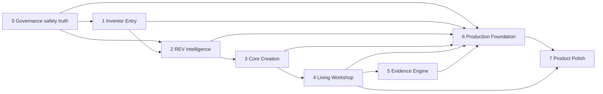

# reAIdea Build Lanes

**Status:** FOUNDER APPROVED — current construction control

**Current reference:** Combined `REV-FIX-02.1–02.4` final Homepage entry checkpoint, Phase 5 Documentation checkpoint, Iteration 3 exact `VPB-HOME-006`, `FOUNDER VISUALLY APPROVED — READY FOR MORNING HANDOVER`. Lane 1 remains the only active delivery lane under `architecture/REV_FIX_02_HOME_ENTRY_BUILD_CONTRACT.md`; every other delivery lane remains inactive and REV-FIX-02.5 is locked.

## Lane rule

Every Build Contract names exactly one active lane. A change may preserve dependencies in other lanes, but it may not modify them. Cross-lane implementation requires an accepted architecture decision recording why separation is unsafe, the combined file boundary, protected invariants, acceptance evidence and rollback.

## Lane 0 — Governance, safety and truth

- **Purpose:** Control authority, provenance, safety, security and construction boundaries.
- **Inputs:** Founder decisions, threat assessments, audit evidence, accepted checkpoints and conflicts.
- **Outputs:** Constitution, architecture registers, Build Contracts, safety policies and acceptance records.
- **Ownership:** Founder owns product decisions; architecture/security own traceable enforcement design.
- **Exclusions:** Production behavior created solely through documentation; silent rewriting of history.
- **Dependencies:** None. Every lane depends on Lane 0.
- **Security boundary:** Deny by default; no secrets or confidential Project content in governance documents.
- **Acceptance gate:** Founder accepts the authority change; conflicts and unresolved matters are explicit; negative truth/safety tests are defined.
- **Current status:** **FOUNDATION / NOT ACTIVE.** Governance controls the active Lane 1 boundary but is not a second implementation lane.

## Lane 1 — Inventor Entry

- **Purpose:** Capture intent, one natural description and optional evidence with minimal cognitive load.
- **Inputs:** Origin intent, description, optional upload and deliberate START action.
- **Outputs:** Cleared frozen submission ready for exactly one Project creation transaction.
- **Ownership:** Home owns transient input; server safety owns preflight; canonical Project writer begins only after CLEAR.
- **Exclusions:** Mandatory technical forms, provider calls while typing, hidden Project creation and duplicate intake truth.
- **Dependencies:** Lane 0.
- **Security boundary:** Untrusted bounded text/files; pre-persistence safety; safe errors; no raw denied input in receipts/logs.
- **Acceptance gate:** HOLD/BLOCK/unavailable create nothing; CLEAR creates one Project; accessibility and no-repetition behavior pass.
- **Current status:** **ACTIVE — COMBINED HOME ENTRY BUILD.** Blank truth, approved visual hierarchy, intent-gated entry and the protected existing `ASK REV` foundation are the only implementation scope.

## Lane 2 — REV Intelligence

- **Purpose:** Build source-traced understanding, route relevance and choose the smallest material question or next action.
- **Inputs:** Canonical Project, cleared interpretation, accepted evidence and decisions.
- **Outputs:** Working understanding, assumptions, bench routing, comparisons and recommendations.
- **Ownership:** Provider-neutral REV orchestration and read models.
- **Exclusions:** Second Project brain, silent Project writes, provider-owned semantics and fabricated conclusions.
- **Dependencies:** Lanes 0 and 1.
- **Security boundary:** Least provider disclosure, output validation, provenance and authorized/cost-controlled operations.
- **Acceptance gate:** No repeated questions; assumptions labelled; smallest blocker only; deterministic safe fallback.
- **Current status:** **PARTIAL.** Description-led routing, source-provenance separation and explicit weapon-construction BLOCK are accepted; S1B safety-HOLD resume and provider-backed smallest-question/research work remain unresolved.

## Lane 3 — Core Creation

- **Purpose:** Create a polished Visual Concept and genuine validated geometry where supportable.
- **Inputs:** Cleared Project submission, interpretation, optional reference and labelled working assumptions.
- **Outputs:** Validated candidate, snapshot, optional geometry plan and source-bound ConceptGeometry.
- **Ownership:** Initial Core Creation orchestrator, candidate domain and geometry domain.
- **Exclusions:** 2D-as-3D, fabrication approval, unsupported geometry invented to claim success and automatic retry.
- **Dependencies:** Lanes 0–2.
- **Security boundary:** Safety before provider work, generated-output validation, bounded schemas, source binding and cost/replay protection.
- **Acceptance gate:** Persist/reload before success; invalid geometry falls back to a valid Visual Concept; no empty Workshop.
- **Current status:** **PARTIAL.** Transaction and portable-signage profile are accepted. Surf-goggle geometry and broad invention support remain unresolved; the Visual Concept fallback is truthful.

## Lane 4 — Living Workshop

- **Purpose:** Present the active invention, REV, eight benches and one useful decision in one continuous workplace.
- **Inputs:** Authorized Project, candidate, validated representation and Workshop recommendation state.
- **Outputs:** Centre-stage representation, bench context, decision panel and deliberate actions.
- **Ownership:** Workshop routing/presentation, bench modules and Prototype3DViewer.
- **Exclusions:** Duplicate stores/timelines, second Canvas, false specialist completion and refresh generation.
- **Dependencies:** Lanes 0–3.
- **Security boundary:** Project/candidate/revision binding, authorized restoration and safe rendering.
- **Acceptance gate:** One Canvas for valid 3D; zero for fallbacks; refresh restores without provider work; station/decision truth passes.
- **Current status:** **PARTIAL.** B2A/B2B-1/B2B-2 accepted; B2B-3A paused uncommitted.

## Lane 5 — Evidence Engine

- **Purpose:** Deliver sourced specialist evidence, validation, decisions and limitations behind the invention.
- **Inputs:** Inventor evidence, external sources, test results, bench contributions, assumptions and decisions.
- **Outputs:** Traceable findings, conclusions, directions, actions, results, risks and next evidence-producing decisions.
- **Ownership:** Project evidence/decision/history domains and specialist read models.
- **Exclusions:** Automatic proof, untraceable research, legal/patent conclusions and certainty scores.
- **Dependencies:** Lanes 0, 2, 3 and 4.
- **Security boundary:** Source authorization, confidentiality, retrieval safety, provenance and deliberate adoption.
- **Acceptance gate:** Every material claim shows source/date, interpretation, limitation and decision impact.
- **Current status:** **PARTIAL.** Strong domain foundations exist; cohesive specialist delivery is not implemented.

## Lane 6 — Production Foundation

- **Purpose:** Make the accepted service safely operable for a limited paid beta.
- **Inputs:** Accepted functional journeys and threat model.
- **Outputs:** Identity, Project authorization, server storage, audit, abuse controls, deployment and recovery.
- **Ownership:** Platform, identity, server persistence and security operations.
- **Exclusions:** Treating browser storage or provider success as production readiness.
- **Dependencies:** Lane 0 and every feature lane entering beta.
- **Security boundary:** Authentication, object authorization, encryption, secrets, CSRF/CORS, rate limits, idempotency, quotas, retention and incidents.
- **Acceptance gate:** Retained negative cross-Project, abuse, upload, recovery, export and deletion evidence.
- **Current status:** **NOT READY.** Material production controls are absent.

## Lane 7 — Product Polish

- **Purpose:** Deliver cohesive responsive, accessible, performant visual quality after behavior and truth are stable.
- **Inputs:** Accepted flows, visual authorities, real runtime states and performance budgets.
- **Outputs:** Final Home/Workshop presentation, accessibility, motion and optimized assets.
- **Ownership:** Presentation components/styles within protected behavior boundaries.
- **Exclusions:** Cosmetic changes that alter Project truth, safety, provider cost, persistence or routing.
- **Dependencies:** Stable behavior from Lanes 0–6, especially Lane 4.
- **Security boundary:** No unsafe HTML, confidential screenshot leakage or unapproved external asset.
- **Acceptance gate:** Founder visual review plus accessibility, reduced-motion, responsive and performance evidence.
- **Current status:** **PAUSED.** B2B-3A is preserved and may resume only through a founder-approved active-lane Build Contract.

## Build Contract minimum

Every Build Contract records: active lane, checkpoint, baseline SHA, allowed paths, protected invariants, exclusions, security/cost implications, acceptance evidence and rollback point. Work stops when the observed boundary differs.
