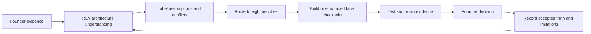

# Project 000 — reAIdea Inventing Itself

**Status:** FOUNDER APPROVED — canonical internal Project 000 record
**Purpose:** Apply reAIdea's own eight-bench discipline to the design, validation and delivery of reAIdea

## Truth vocabulary

- **COMPLETED:** Implemented or formally recorded at an accepted checkpoint.
- **TESTED:** Exercised by automated or retained founder evidence.
- **ASSUMED:** A labelled working belief without sufficient evidence.
- **PLANNED:** Intended work not yet implemented.
- **UNRESOLVED:** Requires founder, architecture or evidence decision.

These labels may coexist. For example, a prototype can be completed and tested while its production suitability remains unproven.

## Project intent

reAIdea is inventing an outcome-delivery service in which an inventor describes an idea once and REV performs rigorous preparation behind the scenes. Project 000 must obey the same rules as an inventor Project: preserve original evidence, separate understanding from assumptions, expose limitations, record deliberate decisions and maintain traceable history.

## Current truth snapshot

| Item | Status | Evidence and limitation |
| --- | --- | --- |
| Founder outcome-delivery direction | COMPLETED / TESTED | Recorded in founder journals and scoped approvals; this consolidated authority remains pending acceptance |
| Canonical Project domain and history | COMPLETED / TESTED | Project evidence, decisions, actions and timeline foundations exist; browser persistence is not production storage |
| Tell REV Once Home journey | COMPLETED / TESTED | Origin intent, description, optional image and one-action initial transaction have acceptance evidence |
| Description-led creation and safety provenance | COMPLETED / TESTED | C1/S1A/FIREARM-SAFETY-001 is committed at `a62b597e32f98669832f30956bc023eadbcc85e0`; acceptance is limited to the tested routing/provenance/BLOCK boundaries |
| Pre-Project intent safety | COMPLETED / TESTED | Provider-free fixtures prove HOLD/BLOCK/unavailable create no Project |
| Concept 01 before navigation | COMPLETED / TESTED | Text and image-assisted paths persisted before Workshop navigation and restored after refresh |
| Truthful Creation Theatre | COMPLETED / TESTED | Real operation phases, no fake percentage/countdown and reduced-motion support |
| Supported portable-signage 3D | COMPLETED / TESTED | Candidate-bound deterministic geometry and podium reveal accepted as working representation only |
| General invention geometry | PLANNED | No broad geometry system has been validated; surf-goggle geometry remains unresolved and uses the truthful Visual Concept fallback |
| Specialist evidence delivery | PLANNED | Domain foundations exist; current sourced specialist services are incomplete |
| Production identity/authorization/storage | PLANNED / NOT READY | Material limited-beta security controls are absent |
| Paid demand and pricing | ASSUMED / UNRESOLVED | No audited market or willingness-to-pay proof exists |

## Eight-bench self-application

### Inventor

- **Completed:** Founding journals and later approvals preserve the desired engineering-partner experience, Tell REV Once, smallest question and final inventor authority.
- **Tested:** Bounded Home and Workshop journeys have founder browser evidence.
- **Unresolved:** Disposition of legacy questionnaire routes.
- **Next decision:** Package the accepted Architecture Authority without unfinished work.

### Engineering

- **Completed:** Project truth, provider boundary, safety policy, candidate binding, geometry validation and one-Canvas contracts exist.
- **Tested:** Focused domain fixtures, TypeScript, builds, diff checks and bounded live journeys support accepted checkpoints.
- **Planned:** Production deployment, authorization, secure persistence and broader geometry architecture.
- **Next decision:** Select the next active lane after authority packaging.

### Prototype

- **Completed:** Home, Creation Theatre, Visual Concept fallback, Living Workshop and Prototype3DViewer foundations exist.
- **Tested:** Persistence, refresh restoration, fit/reset, orbit, full screen, joint rotation and podium ownership have retained evidence.
- **Assumed:** Current interactions will generalize to other invention classes.
- **Next decision:** Preserve B2B-3A while defining bounded physical-product geometry support; do not rebuild the viewer.

### Testing

- **Completed:** Fixtures cover Project/storage, safety, transaction, candidate, geometry, transforms and stage presentation.
- **Tested:** Controlled live and provider-free reviews demonstrate safe failure, deliberate retry and no refresh regeneration.
- **Planned:** Cross-Project authorization, abuse, retention/deletion, disaster recovery, performance and comprehensive accessibility suites.
- **Next decision:** Define the minimum beta test/evidence matrix in Lane 6.

### Patent/IP

- **Completed:** Product truth requires sourced preliminary findings and a non-legal-advice boundary.
- **Planned:** Authorized sources, query provenance, source-date, limitations and deliberate adoption workflow.
- **Unresolved:** No evidence establishes patentability or freedom to operate for reAIdea.
- **Next decision:** Approve a bounded evidence-source contract before live research.

### Manufacturing

- **Completed:** A local Next.js prototype, provider adapters and browser persistence support construction testing.
- **Assumed:** The stack can support a limited beta after production controls are built.
- **Planned:** Hosting, encrypted storage, monitoring, backup/recovery, quotas, budgets and release procedures.
- **Next decision:** Approve production architecture and operating cost envelope.

### Marketing

- **Completed:** Founder positioning defines a persistent invention/engineering partner delivering outcomes with minimal inventor effort.
- **Assumed:** Target inventors and commercial reviewers will value and pay for this service.
- **Planned:** Evidence-led customer discovery, message tests, acquisition experiments and pricing validation.
- **Unresolved:** No market proof or paid-beta pricing is approved.
- **Next decision:** Define the smallest ethical invitation-only pilot hypothesis.

### Reality Check

- **Confirmed strengths:** Clear founder direction; strong truth and safety foundations; accepted initial creation transaction; source-bound candidate/geometry; one-Canvas Workshop.
- **Material risks:** Fragmented historical authority, narrow geometry support, incomplete specialist intelligence, browser-only persistence, no production identity/object authorization and unproven demand.
- **Limitation:** Successful prototypes and founder enthusiasm are not security, engineering or market proof.
- **Next decision:** Package the accepted authority, then choose bounded geometry support, Evidence Engine or preserved Product Polish through one active lane.

## Project 000 working sequence

## Evidence rule

Every material Project 000 decision records what was observed, source evidence, REV interpretation, working assumptions, limitations, deliberate decision, rollback point and next evidence-producing action. Roadmap completion, test counts, visual polish, model confidence and provider success never substitute for product, engineering, security or market evidence.
