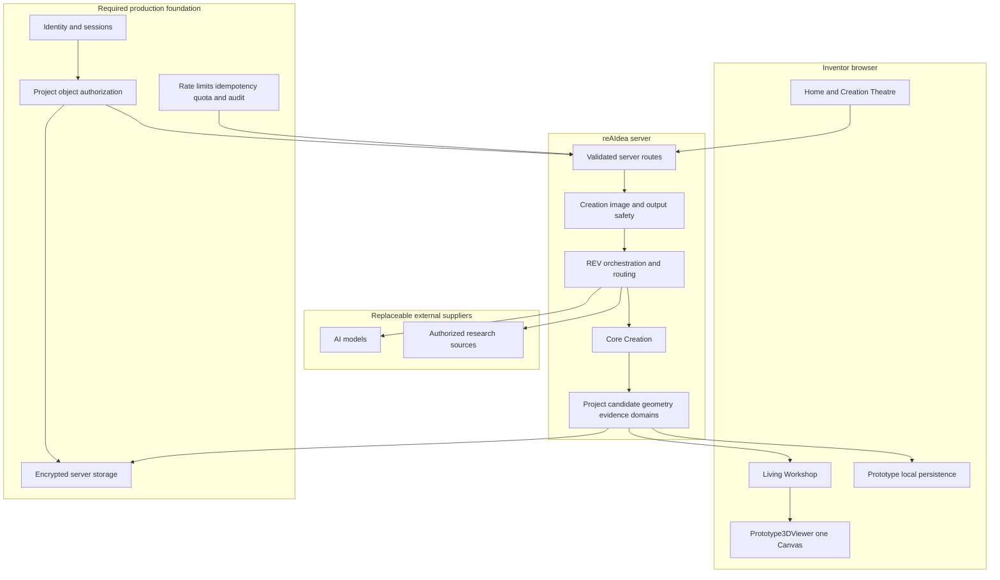
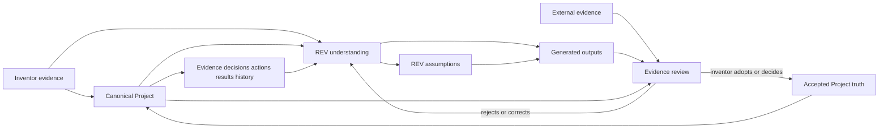
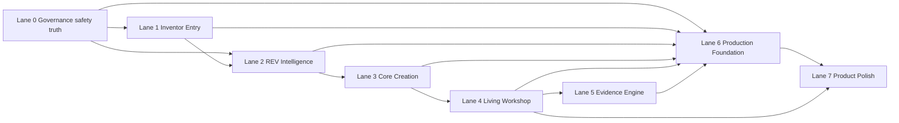
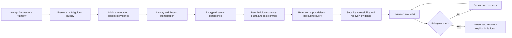

# reAIdea Flight Plan

**Status:** FOUNDER APPROVED — current shared construction plan
**Pushed Stage 1C checkpoint baseline:** `cd56dcced53a43b1fe69b1778676733d15394537`
**Branch:** `sprint006-build24-40-home-rebuild`
**Current reference:** Stage 1D-A — `DESKTOP OPENING CONSOLE-ENTRY SHELL` — documentation boundary recorded; candidate preparation locked
**Current phase:** Governance and checkpoint control — Stage 1D-A documentation boundary recorded
**Current lane:** Lane 0 — recovery/control
**Current status:** Stage 1C-A, Stage 1C-B and Stage 1C-C are FOUNDER VISUALLY APPROVED, DOCUMENTED, BYTE-LOCKED AND REMOTELY CHECKPOINTED; Stage 1D-A candidate preparation remains locked
**Active Build Contract:** NONE
**Locked next work:** Stage 1D-A candidate preparation, console controls beyond the opening shell, production implementation and `REV-FIX-02.5` Phase 2 Build remain locked

Stage 1C is complete as a visual-authority checkpoint only. Stage 1D-A is the proposed `DESKTOP OPENING CONSOLE-ENTRY SHELL`, bounded by `STAGE_1D_A_DESKTOP_OPENING_CONSOLE_ENTRY_SHELL_VISUAL_CONTRACT.md`. This record authorizes documentation only; no candidate, production implementation or active Build Contract exists.

Earlier REV-FIX-02.4 iterations, lane markers and technical milestones below are preserved as dated construction history. They do not authorize a Build phase, visual progression or production correction.

## Purpose

This Flight Plan translates the Founder Product Constitution into one controlled route from the current prototype to a limited paid beta. It controls sequence, dependencies and acceptance; it does not itself authorize production implementation.

The companion registers are:

- `PAGE_BLUEPRINT_REGISTER.md` — page-by-page ownership and acceptance;
- `VISUAL_AUTHORITY_REGISTER.md` — approved images and superseded references;
- `BUILD_LANES.md` — lane contracts and status;
- `SUPERSESSION_REGISTER.md` — explicit resolution of stale rules;
- `AGENT_HANDOVER_STANDARD.md` — continuity and rollback evidence;
- `PROJECT_000_REAIDEA.md` — reAIdea applying its own method to itself.

## Outcome-delivery journey

```mermaid
flowchart LR
    I[Choose intent] --> D[Describe once]
    D --> S[Safety and upload preflight]
    S -- CLEAR --> P[Create and verify canonical Project]
    S -- HOLD --> Q[One smallest purpose question]
    S -- BLOCK or unavailable --> X[No persistence or generation]
    Q --> D
    P --> U[ASK REV understanding loop]
    U --> Q[One useful question at a time]
    Q --> U
    U --> T[Ready to create supported 3D]
    T --> C[Creation Theatre with real phases]
    C --> G[Concept 01 and supported geometry]
    G --> V[Validate fidelity safety geometry and source binding]
    V --> R[Persist and reload verification]
    R --> E[Deliberate Enter Workshop]
    E --> W[Same stored 3D on centre podium]
    W --> B[Route understanding to relevant benches]
    B --> E[Specialist evidence and limitations]
    E --> N[One next useful decision]
    N --> H[Decision validation and Project history]
    H --> W
```

## Runtime architecture

Browser persistence is a prototype continuity mechanism, not a production security or authorization boundary.

## Project truth and evidence architecture

Derived read models may support routing and presentation, but they cannot become parallel Project truth.

## Construction dependency map

Only one lane may be active in a Build Contract. Cross-lane work requires a founder-approved architecture decision that lists the dependency, bounded files, protected behavior, combined acceptance and rollback.

## Current flight position

The detailed current reference, phase, iteration, path boundary and founder gate exist only in `CURRENT_CONSTRUCTION_STATE.md`. Every earlier `HAI-1`, C2F or HP-24.* next action is superseded as permission and retained only as evidence.

| Area | Verified position | Next controlled gate |
| --- | --- | --- |
| Governance and safety | Lane 0 governance/checkpoint control is current; Stage 1C is remotely checkpointed at `cd56dcced53a43b1fe69b1778676733d15394537`; no production Build Contract is active | Preserve the accepted checkpoint; Stage 1D-A candidate preparation requires separate founder authorization |
| Inventor Entry | `VPB-HOME-008/009/010` protect separate desktop environment, REV and live-brand layers; `VPB-HOME-006/007` remain flattened composition references only; post-ASK remains rejected | Stage 1D-A documentation boundary only; candidate preparation, controls beyond the opening shell and production integration remain locked |
| REV Intelligence | `REV-FIX-02.5` contract is preserved as a queued future boundary; existing answer persistence/source foundations remain evidence; Home-to-Workshop value routing defect remains unresolved | Locked until all remaining `.4` visual-recovery stages are completed/documented and the founder explicitly authorizes Phase 2; providers remain prohibited |
| Core Creation | Concept persistence and bounded portable-signage geometry accepted; surf-goggle geometry remains unsupported | Define source-aware fidelity and supported geometry before claiming `READY TO CREATE 3D` |
| Living Workshop | B2A, B2B-1 and B2B-2 functional checkpoints accepted | Preserve the viewer; later contract deliberate entry and same-stored-model arrival after `FAIL-NAV-001` diagnosis |
| Evidence Engine | Project evidence/decision/action/result foundations exist | Define minimum sourced specialist output and adoption flow |
| Production Foundation | Material controls absent | Identity, authorization and server persistence architecture |
| Product Polish | Home/Workshop visual foundations are partial | Resume only after founder selects the active lane |

## Roadmap to limited paid beta

Exit gates require a truthful golden journey, safe failure, no cross-Project access, cost controls, accessible responsive behavior, recoverable storage and explicit founder acceptance. Visual polish or a successful provider call cannot substitute for these gates.

## REV-FIX-02 controlled sequence

The near-term flight order is `REV-FIX-02.1` Blank Home truth; `.2` Blank Home visual layout; `.3` Data entry and optional image; `.4` ASK REV and canonical Project creation; `.5` Answer, knowledge and understanding; `.6` Ready state and Creation Theatre handoff; `.7` Professional electrical system; `.8` Professional 3D quality target; `.9` Live formation, fidelity and securing; `.10` Complete blank-to-Workshop journey.

Only the reference named in `CURRENT WORK` may proceed. On 28 August 2026 the founder registered `VPB-HOME-007` for the selected-path/pre-ASK state and directed `VPB-HOME-001/004/004A/005` into historical archive so they cannot return as runtime or fallback authority. `.4` remains founder rejected inside the same category. The `.5` contract is approved only as a queued future boundary; `.6–.10` remain locked.

## Immediate hold

The dominant current position is Lane 0 governance/checkpoint control at pushed Stage 1C baseline `cd56dcced53a43b1fe69b1778676733d15394537`. Stage 1C-A, Stage 1C-B and Stage 1C-C are founder visually approved, documented, byte-locked and remotely checkpointed. Stage 1D-A `DESKTOP OPENING CONSOLE-ENTRY SHELL` is defined only as a future candidate boundary; candidate preparation remains locked pending separate authorization. No production Build Contract is active, and `REV-FIX-02.5` Phase 2 remains locked.

The former statement naming Lane 1, Phase 2, Iteration 3 and the numbered current-image review as the immediate gate is **SUPERSEDED — HISTORICAL EVIDENCE ONLY**. It grants no current implementation or phase-advance authority.
