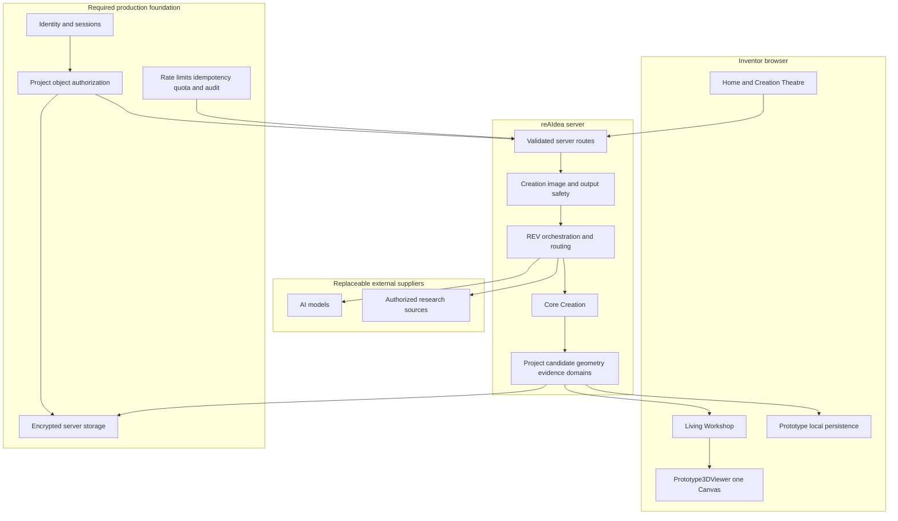
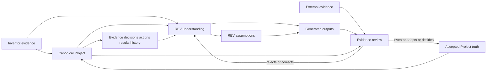
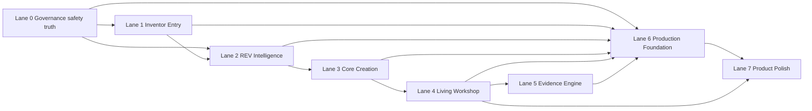
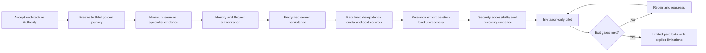

# reAIdea Flight Plan

**Status:** FOUNDER APPROVED — current shared construction plan
**Baseline:** `27592acd8c7eb2bca3d7734adae923c9b29fdc69`
**Branch:** `sprint006-build24-40-home-rebuild`
**Active work:** Lane 1 combined `REV-FIX-02.1–02.4` final Homepage entry checkpoint; Phase 5 Documentation checkpoint; exact `VPB-HOME-006` founder approved

## Purpose

This Flight Plan translates the Founder Product Constitution into one controlled route from the current prototype to a limited paid beta. It controls sequence, dependencies and acceptance; it does not itself authorize production implementation.

The companion registers are:

- `PAGE_BLUEPRINT_REGISTER.md` — page-by-page ownership and acceptance;
- `VISUAL_AUTHORITY_REGISTER.md` — approved images and superseded references;
- `BUILD_LANES.md` — lane contracts and status;
- `SUPERSESSION_REGISTER.md` — explicit resolution of stale rules;
- `AGENT_HANDOVER_STANDARD.md` — continuity and rollback evidence;
- `PROJECT_000_REAIDEA.md` — reAIdea applying its own method to itself.

## Outcome-delivery journey

```mermaid
flowchart LR
    I[Choose intent] --> D[Describe once]
    D --> S[Safety and upload preflight]
    S -- CLEAR --> P[Create and verify canonical Project]
    S -- HOLD --> Q[One smallest purpose question]
    S -- BLOCK or unavailable --> X[No persistence or generation]
    Q --> D
    P --> U[ASK REV understanding loop]
    U --> Q[One useful question at a time]
    Q --> U
    U --> T[Ready to create supported 3D]
    T --> C[Creation Theatre with real phases]
    C --> G[Concept 01 and supported geometry]
    G --> V[Validate fidelity safety geometry and source binding]
    V --> R[Persist and reload verification]
    R --> E[Deliberate Enter Workshop]
    E --> W[Same stored 3D on centre podium]
    W --> B[Route understanding to relevant benches]
    B --> E[Specialist evidence and limitations]
    E --> N[One next useful decision]
    N --> H[Decision validation and Project history]
    H --> W
```

## Runtime architecture

Browser persistence is a prototype continuity mechanism, not a production security or authorization boundary.

## Project truth and evidence architecture

Derived read models may support routing and presentation, but they cannot become parallel Project truth.

## Construction dependency map

Only one lane may be active in a Build Contract. Cross-lane work requires a founder-approved architecture decision that lists the dependency, bounded files, protected behavior, combined acceptance and rollback.

## Current flight position

The detailed current reference, phase, iteration, path boundary and founder gate exist only in `CURRENT_CONSTRUCTION_STATE.md`. Every earlier `HAI-1`, C2F or HP-24.* next action is superseded as permission and retained only as evidence.

| Area | Verified position | Next controlled gate |
| --- | --- | --- |
| Governance and safety | Founder Control System approved; Home contract and exact visual authority registered | Preserve the active Lane 1 boundary and security controls |
| Inventor Entry | Exact `VPB-HOME-006` Homepage entry, blank truth, input and protected `ASK REV` foundation founder approved | Morning handover; founder separately decides whether to authorize a REV-FIX-02.5 contract |
| REV Intelligence | Description-led routing, source-provenance separation and explicit weapon-construction BLOCK are accepted at `a62b597e32f98669832f30956bc023eadbcc85e0` | LOCKED until the controlling REV-FIX reference reaches it |
| Core Creation | Concept persistence and bounded portable-signage geometry accepted; surf-goggle geometry remains unsupported | Define source-aware fidelity and supported geometry before claiming `READY TO CREATE 3D` |
| Living Workshop | B2A, B2B-1 and B2B-2 functional checkpoints accepted | Preserve the viewer; later contract deliberate entry and same-stored-model arrival after `FAIL-NAV-001` diagnosis |
| Evidence Engine | Project evidence/decision/action/result foundations exist | Define minimum sourced specialist output and adoption flow |
| Production Foundation | Material controls absent | Identity, authorization and server persistence architecture |
| Product Polish | Home/Workshop visual foundations are partial | Resume only after founder selects the active lane |

## Roadmap to limited paid beta

Exit gates require a truthful golden journey, safe failure, no cross-Project access, cost controls, accessible responsive behavior, recoverable storage and explicit founder acceptance. Visual polish or a successful provider call cannot substitute for these gates.

## REV-FIX-02 controlled sequence

The near-term flight order is `REV-FIX-02.1` Blank Home truth; `.2` Blank Home visual layout; `.3` Data entry and optional image; `.4` ASK REV and canonical Project creation; `.5` Answer, knowledge and understanding; `.6` Ready state and Creation Theatre handoff; `.7` Professional electrical system; `.8` Professional 3D quality target; `.9` Live formation, fidelity and securing; `.10` Complete blank-to-Workshop journey.

Only the reference named in `CURRENT WORK` may proceed. The founder combined `.1–.4` for the Home entry walkthrough on 27 August 2026; `.5–.10` remain locked.

## Immediate hold

Lane 1 is active under `architecture/REV_FIX_02_HOME_ENTRY_BUILD_CONTRACT.md`. Combined `REV-FIX-02.1–02.4` is at Phase 5 Documentation checkpoint, Iteration 3. `VPB-HOME-006` controls the final Homepage entry. B2B-3A and C2 remain non-authoritative archive evidence; HAI-1 and C2F remain superseded as next actions. `.5` and later remain locked.
