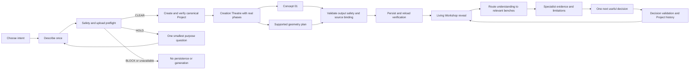
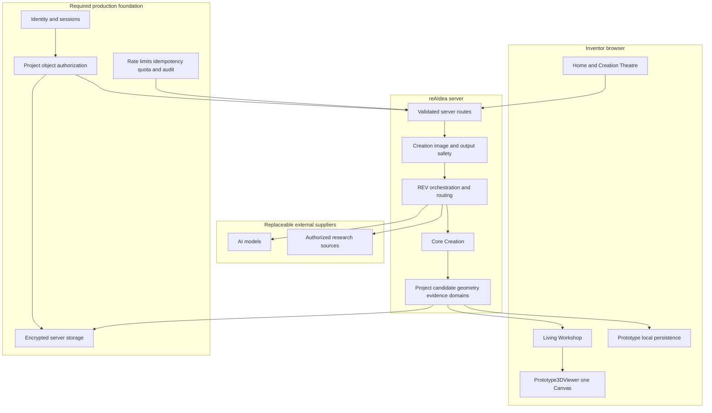
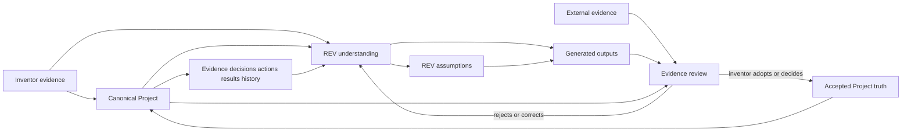
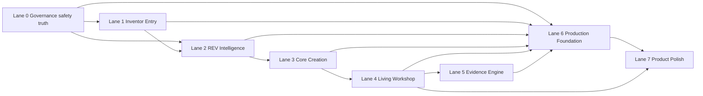
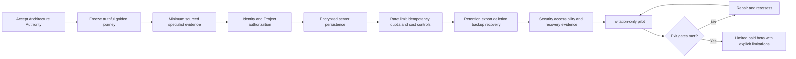

# reAIdea Flight Plan

**Status:** FOUNDER APPROVED — current shared construction plan
**Baseline:** `a62b597e32f98669832f30956bc023eadbcc85e0`
**Branch:** `sprint006-build24-40-home-rebuild`
**Active work:** Lane 0 authority reconciliation and packaging; B2B-3A is paused and uncommitted

## Purpose

This Flight Plan translates the Founder Product Constitution into one controlled route from the current prototype to a limited paid beta. It controls sequence, dependencies and acceptance; it does not itself authorize production implementation.

The companion registers are:

- `PAGE_BLUEPRINT_REGISTER.md` — page-by-page ownership and acceptance;
- `VISUAL_AUTHORITY_REGISTER.md` — approved images and superseded references;
- `BUILD_LANES.md` — lane contracts and status;
- `SUPERSESSION_REGISTER.md` — explicit resolution of stale rules;
- `AGENT_HANDOVER_STANDARD.md` — continuity and rollback evidence;
- `PROJECT_000_REAIDEA.md` — reAIdea applying its own method to itself.

## Outcome-delivery journey

## Runtime architecture

Browser persistence is a prototype continuity mechanism, not a production security or authorization boundary.

## Project truth and evidence architecture

Derived read models may support routing and presentation, but they cannot become parallel Project truth.

## Construction dependency map

Only one lane may be active in a Build Contract. Cross-lane work requires a founder-approved architecture decision that lists the dependency, bounded files, protected behavior, combined acceptance and rollback.

## Current flight position

| Area | Verified position | Next controlled gate |
| --- | --- | --- |
| Governance and safety | Constitution and authority hierarchy are founder accepted; packaging is uncommitted | Verify and package the reconciled authority without unfinished work |
| Inventor Entry | Responsive Home, origin intent, readiness, optional image and one-action transaction accepted | Final responsive product review after architecture acceptance |
| REV Intelligence | Description-led routing, source-provenance separation and explicit weapon-construction BLOCK are accepted at `a62b597e32f98669832f30956bc023eadbcc85e0` | Define S1B separately; do not infer acceptance of provider-backed smallest-question work |
| Core Creation | Concept persistence and bounded portable-signage geometry accepted; surf-goggle geometry remains unsupported | Define bounded physical-product geometry support without rebuilding the viewer |
| Living Workshop | B2A, B2B-1 and B2B-2 functional checkpoints accepted | Decide whether to resume paused B2B-3A in Lane 7 or address Lane 5 first |
| Evidence Engine | Project evidence/decision/action/result foundations exist | Define minimum sourced specialist output and adoption flow |
| Production Foundation | Material controls absent | Identity, authorization and server persistence architecture |
| Product Polish | Home/Workshop visual foundations are partial | Resume only after founder selects the active lane |

## Roadmap to limited paid beta

Exit gates require a truthful golden journey, safe failure, no cross-Project access, cost controls, accessible responsive behavior, recoverable storage and explicit founder acceptance. Visual polish or a successful provider call cannot substitute for these gates.

## Immediate hold

No production lane is active while the founder-approved Architecture and Visual Authority records are reconciled and packaged. The two-file B2B-3A diff is preserved as an uncommitted rollback-safe experiment. A later production step requires one active lane and a founder-approved Build Contract before coding resumes.
