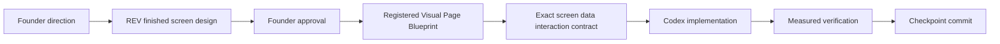

# reAIdea Visual Blueprint Standard

**Status:** FOUNDER APPROVED — mandatory visual-first construction standard
**Applies to:** Every new or materially changed production screen/state

## Required sequence

No stage may be skipped. A visual reference, chat instruction, implementation screenshot or earlier page approval does not approve another screen/state.

## One-screen rule

- Work on one route, screen and material state at a time.
- A responsive family may share one blueprint only when desktop and mobile designs/states are both explicitly approved.
- Loading, empty, error, denied, success, fallback, modal and reduced-motion states are separate material states unless the blueprint expressly includes them.
- A blueprint may protect existing behavior but cannot silently authorize provider, Project, storage, geometry or security changes.
- Only one active build lane applies unless a founder-approved architecture decision authorizes a bounded cross-lane contract.

## Blueprint lifecycle

| Status | Meaning | Production implementation |
| --- | --- | --- |
| DESIGN REQUIRED | Founder direction exists but no finished design is registered | Prohibited |
| DESIGNING | REV is preparing the finished screen design | Prohibited |
| FOUNDER APPROVED | Exact design/version approved; implementation contract not yet accepted | Prohibited |
| CONTRACTED | Exact screen/data/interaction contract and file boundary approved | Permitted only within contract |
| IMPLEMENTING | Bounded implementation underway | Permitted within contract |
| VERIFIED | Required measurements/checks passed; commit not yet completed | No expansion |
| COMMITTED | Accepted checkpoint committed and, where authorized, pushed | Closed; later changes need a new version |

The living page/lane tick-sheet uses `NOT DESIGNED` for a DESIGN REQUIRED blueprint, then the common statuses `DESIGNING`, `FOUNDER APPROVED`, `CONTRACTED`, `IMPLEMENTING`, `VERIFIED` and `COMMITTED`.

## Mandatory Visual Page Blueprint record

Every approved blueprint records:

1. **Blueprint ID and screen name.** Stable ID such as `VPB-HOME-001`.
2. **Route and exact state.** Public, authenticated, loading, empty, working, error, modal or fallback.
3. **Purpose and intended outcome.** What the inventor achieves on this screen.
4. **Founder direction.** Link to the exact scoped record.
5. **Desktop image.** Canonical repository path, dimensions, format, version and SHA-256.
6. **Mobile image.** Canonical repository path, dimensions, format, version and SHA-256.
7. **Approval.** Status, exact version, founder approval date and approval record path.
8. **Wording.** Exact headings, labels, helper text, status and limitations; identify dynamic text.
9. **Controls.** Every control, label, disabled rule, focus order and touch target.
10. **Interactions.** Click, keyboard, pointer, touch, focus, navigation, modal and recovery behavior.
11. **States.** Initial, working, success, failure, empty, fallback, denied, offline and reduced-motion where applicable.
12. **Data truth.** For every visible datum: real canonical data, derived REV understanding, labelled assumption, generated output, external evidence or decorative-only.
13. **Layer ownership.** Background asset, REV asset, live HTML, inline SVG, Canvas, modal/portal and decorative layers.
14. **Dimensions and responsiveness.** Reference viewport, breakpoints, cropping, stacking, scrolling and overflow constraints.
15. **Accessibility.** Semantics, labels, focus, contrast, keyboard, live regions, motion and assistive status.
16. **Security/privacy.** Confidential text/image handling, authorization, unsafe HTML prohibition, external asset/request policy and screenshot/evidence limits.
17. **Protected plumbing.** Project, provider, safety, persistence, candidate, geometry, one-Canvas and navigation behavior that cannot change.
18. **Implementation contract.** Exact files, exclusions, active lane, checks and rollback point.
19. **Verification evidence.** Required viewport captures, DOM/network counts, functional checks, hashes and founder review.
20. **Limitations and next decision.** What remains unapproved or outside the blueprint.

Missing desktop/mobile images, version, approval date or SHA-256 must be written as **MISSING — IMPLEMENTATION PROHIBITED**, never inferred.

## Real versus decorative data

- Real status is driven by persisted or current operation state.
- REV understanding and assumptions are labelled and source-traceable.
- Decorative diagrams, energy paths, grids and emblems use `aria-hidden="true"` and cannot imply completion.
- No fake percentage, countdown, checkmark, confidence or professional approval.
- A Canvas appears only for validated geometry; Visual Concept fallback remains explicitly 2D.

## Asset and evidence control

- Reference the canonical file in `architecture/VISUAL_AUTHORITY_REGISTER.md`; do not duplicate large images.
- Temporary or rejected images stay outside authority and are never promoted without explicit founder approval, repository path and hash.
- Founder review evidence belongs in the dated Evidence Index or approved external archive, not production assets.
- Modifying an approved image creates a new version and requires fresh approval.

## Implementation gate

Before code changes, Codex reports blueprint ID/version, founder approval record, active lane, baseline, exact file boundary, protected invariants, acceptance tests and rollback. If any item is absent, stop before implementation.

## Registered foundation

`VPB-HOME-001`, `VPB-WORKSHOP-001` and `VPB-JOURNEY-001` are founder-approved visual authorities registered in `visual-authority/SCREEN_INDEX.md`. Approval of their images does not authorize a later production change without an exact screen/data/interaction Build Contract.

Home understanding/readiness never uses percentages, confidence, feasibility or probability-of-success claims. Workshop progress may use a percentage only when it is calculated from real canonical Project state; static, invented or unsupported values remain prohibited.
